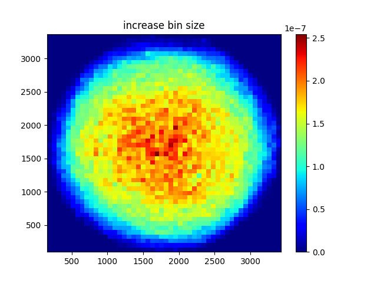
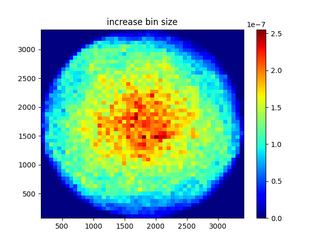
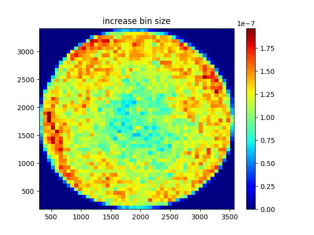

# Data analysis

## Environment setup
create and activate conda environment:
```{r}
conda env create --n fish -f environment.yml 
conda activate fish
```

## Run analysis
* `fish_prob_parall.py`: calculates the probability density of fishes within the tank and the cosine similarity between different fish movements.
  * `--f`: select experiment based on number of fishes (i.e. 60, 80, or 100)
  * `--e`: select experiment 1, 2, or 3
  * `--i`: set interval between frames for `matplotlib.animation`

## Example
run analysis considering experiment 2 with 100 fishes and interval 20:
```{r}
python fish_prob_parall.py --f 100 --e 2 --i 20
```

### Cosine Similarity
#### Experiment 2 Fishes 100


#### Experiment 2 Fishes 60


### Probability Density
#### Experiment 2 Fishes 100


#### Experiment 2 Fishes 60


#### Experiment 1 Fishes 60


